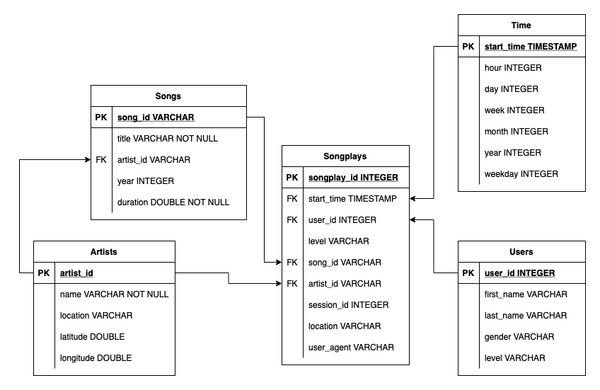

# Sparkify DWH

## Sparkify

Sparkify is a learning project which aims at analyzing collected data from songs and user activity on a music streaming app. Analysts want to understand what songs users are listening to. Currently, they don't have an easy way to query their data, which resides in a directory of JSON logs on user activity on the app, as well as a directory with JSON metadata on the songs in their app.

## Datasets

### Songs Dataset

The first dataset is a subset of real data from the [Million Song Dataset](http://millionsongdataset.com). Each file is in JSON format and contains metadata about a song and the artist of that song. The files are partitioned by the first three letters of each song's track ID.

### Logs Dataset

The second dataset consists of log files in JSON format generated by this event simulator based on the songs in the dataset above. These simulate activity logs from a music streaming app based on specified configurations. The log files in the dataset are partitioned by year and month.

## How to run the scripts

First, you need to start by creating the resources needed for the Redshift cluster by running the create_cluster script `python3 scripts/create_cluster.py`

Once the cluster is up and running, you can create database tables of the defined schema `python3 scripts/create_tables.py`
This script establishes a connection to DB, drops all tables, creates them again with the schema identified in (sql_queries)[scripts/sql_queries.py] script, and closes the DB connection.  

To run the etl script and process the datasets `python3 scripts/etl.py`
This script establishes a connection to DB, bulk copies all songs and events files into the staging tables, then inserts them into the schema tables, and closes the DB connection,

## Schema

The following schema is following the [star schema](https://en.wikipedia.org/wiki/Star_schema) concept for DWHs. It is efficient for storing data and quering it in a relational DB.   

## Choosing distribution and sort keys for the schema

[https://docs.aws.amazon.com/redshift/latest/dg/c_best-practices-sort-key.html](https://docs.aws.amazon.com/redshift/latest/dg/c_best-practices-sort-key.html)

## Upserting into Redshift

[https://docs.aws.amazon.com/redshift/latest/dg/merge-specify-a-column-list.html](https://docs.aws.amazon.com/redshift/latest/dg/merge-specify-a-column-list.html)
